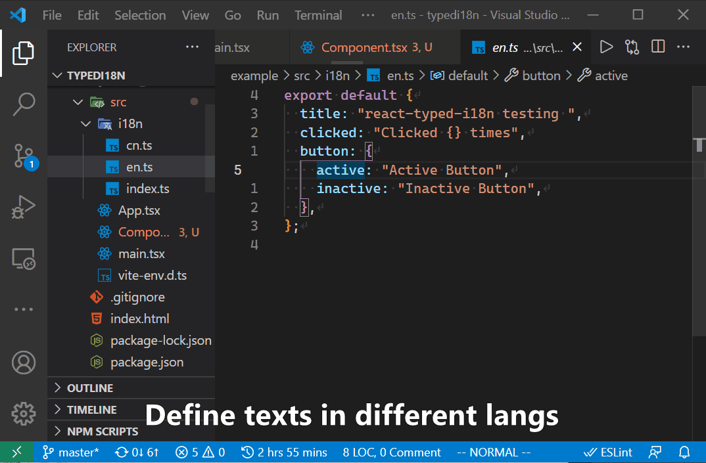

<h1 style="text-align: center">react-typed-i18n</h1>

<div style="text-align: center">


[](https://github.com/ddadaal/react-typed-i18n/actions/workflows/build.yml)
[](https://coveralls.io/github/ddadaal/react-typed-i18n?branch=master)

</div>

<p style="text-align: center">
A strongly typed i18n library for react.
</p>




# Install

```
npm install --save react-typed-i18n
```

# Features

- **Typechecked** text id using TypeScript's [Template Literal Types](https://www.typescriptlang.org/docs/handbook/2/template-literal-types.html)
- **Interpolation** with `string` and `React.ReactNode`
- **Async language loading** for code splitting
- **Hot language reloading** without reloading page
- Supports **partially defined languages**
- No external dependency and **1.3 KiB** gzipped
- **100%** line and branch test coverage

This library is the successor of [`simstate-i18n`](https://github.com/ddadaal/simstate-i18n). Most concepts and functionalities remain unchanged, but this library

- removes the [`simstate`](https://github.com/ddadaal/simstate) dependency
- use Template Literal Types to typecheck the text id
- is way easier to setup

# Example

My personal website [ddadaal.me](https://ddadaal.me) is built with this library.

A example project is provided under the `example` folder. Run the following commands to run it.

```bash
# On the library project root
npm install
npm run build
cd example
npm run dev
```

# Usage

1. Define your definitions (one file per language)
    - use `{}` or `{key}` as placeholders for interpolation ([more details about interpolation](#interpolations))
    - object can be nested
    - all languages should have identical structures
    - this object is called `Language`

```tsx
// ./src/i18n/en
export default {
  title: "Title",
  hello: {
    world: "Hello {} World {}",
  }
}

// ./src/i18n/cn
export default {
  title: "标题",
  hello: {
    world: "你好 {} 世界 {}",
  },
}

// ./src/i18n/partial
// Title is not defined for this partial language
export default {
  hello: {
    world: "你好 {} 世界 {}",
  },
}
```

2. Define all your languages and create elements from `createI18n`
    - The key of `languages` is the **id** of the language;
    - The value of `languages` is `Language` or `() => Promise<Language>`
    - Use `languageDictionary` helper to create the initialization arg
```tsx
// ./src/i18n/index.ts
import { createI18n, languageDictionary } from "react-typed-i18n";

const cn = () => import("./cn").then((x) => x.default);
const en = () => import("./en").then((x) => x.default);
const partial = () => import("./partial").then((x) => x.default);

export const languages = languageDictionary({
  cn,
  en,
});

export const { Localized, Provider, id, prefix, useI18n } = createI18n(languages, {
  fallbackLanguageId: "en",
  languages: { parital },
});
```

3. Wrap the component tree with `Provider` component
    - A `Language` object and its corresponding id must be provided for the `Provider` compoennt
    - In some circumstances (like SSR), rather than importing `Language` directly, `Language` can be asyncly loaded and provided.

```tsx
// ./src/Root.tsx
import React from "react";
import en from "./i18n/en";
import { Provider } from "./i18n";
import App from "./App";

export default () => {
  return (
    <Provider initialLanguage={{
      id: "en",
      definitions: en,
    }}>
      <App />
    </Provider>
  );
}
```

4. Use `Localized` in places of raw texts
    - Use `args` prop to interpolate args into the placeholders (you can pass array or object as arguments. [Learn More](#interpolations))
    - A type error will be reported if the id is not valid
    - The `Localized` must be imported from where the `createI18n` is called (for example, `./src/i18n`)
    - The below displays: Hello **AAA** World **BBB**

```tsx
// ./src/App.tsx
import React from "react";
import { Localized } from "./src/i18n";

export default () => {
  return (
    <div>
      <p>
        <Localized
          id="hello.world"
          args={[
            <strong key="1">AAA</strong>,
            <strong key="2">BBB</strong>,
          ]}
        />
      </p>
    </div>
  );
}
```

5. Use `useI18n` hook to get helper functions like `setLanguageById`
    - After clicking the button, the p will display: 你好 **AAA** 世界 **BBB**

```tsx
// ./src/App.tsx
import React from "react";
import { Localized, useI18n } from "./src/i18n";

export default () => {
  const { setLanguageById } = useI18n();
  return (
    <div>
      <p>
        <Localized
          id="hello.world"
          args={[
            <strong key="1">AAA</strong>,
            <strong key="2">BBB</strong>,
          ]}
        />
      </p>
      <button onClick={() => setLanguageById("cn")}>
        Change to cn
      </button>
    </div>
  );
}
```

# Interpolations

`react-typed-i18` uses `{}` or `{key}` as placeholders for interpolations.

- `{key}` will be replaced with `args[key]`
- `{}` will be replaced with `args[i]`, where `i` is `i`th occurrence of `{}` (not counting `{key}`) in the definition string
  - if `args` is not an array, it will be replaced with `Object.values(args)[i]`.
    - It's not recommended since the order of the resulting array may not be trivial.
- If the string to be replaced is `undefined`, it will be replaced as empty string
- If `{}` or `{key}` is prefixed with `\`, it will be escaped. Prefix a `\` with a `\` will not escape the following `{}` or `{key}`

`{}` and `{key}` can co-exist in one definition.

See the examples:

| definition          | `args`                                 | result                  |
| ------------------- | -------------------------------------- | ----------------------- |
| `{} {}`             | `["1", "2"]`                           | `1 2`                   |
| `{1} {0}`           | `["1", "2"]`                           | `2 1`                   |
| `{key2} {key1}`     | `{"key1": "value1", "key2": "value2"}` | `value2 value1`         |
| `{1} {0}`           | `{"key1": "value1", "key2": "value2"}` | `value2 value1`         |
| `{} {1} {0} {}`     | `["1", "2"]`                           | `1 2 1 2`               |
| `{} {key2} {1} {}`  | `["1", "2"]`                           | `1  2 1`                |
| `{} {key2} {1} {}`  | `{"key1": "value1", "key2": "value2"}` | `value1 value2  value2` |
| `\{0} \\{0} \\\{0}` | `["1"]`                                | `\{0} \1 \\{0}`         |


# Helpers

## Helpers functions to generate text id

```tsx
import { prefix, id } from "./i18n";

// id is just an identity function with typecheck
const i = id("hello.world"); // id === "hello.world"

// prefix generates a prefix function.
// When the function is called,
// two part are concatenated.
// both part are typechecked.
const p = prefix("hello.");
const fullId = p("world");
```

## All ids type

```tsx
// src/i18n/en.ts
export default {
  a: "a",
  b: {
    c: "c",
  },
};

// src/i18n/index.ts
import { TextIdFromLangDict } from "react-typed-i18n";

// "a" | "b.c"
export type TextId = TextIdFromLangDict<typeof languages>;
```


# License

MIT
